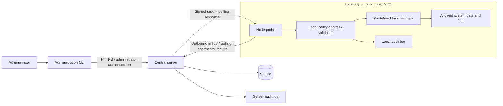

# Argus-C2

A self-hosted remote administration and incident-response control plane for Linux VPS infrastructure you own and administer.

Argus-C2 is planned as a Go-based system comprising a central server, lightweight node probes, and an administration CLI. Its scope covers system visibility, SSH configuration checks, authorized-key auditing, and explicitly authorized, narrowly defined maintenance tasks.

The central design goal is: **compromising the management server must not give an attacker arbitrary command execution or arbitrary filesystem write access across enrolled nodes.** Each probe independently validates incoming tasks against a locally controlled policy that defines its maximum authority.

**Project status**

Phases 1 through 3 are implemented: architecture and protocol foundations, explicit one-time enrollment, persistent node identities, mTLS heartbeats, and locally configured Linux system information and basic metrics. SQLite stores registrations, disablement, and each node's latest report. Remote task dispatch, execution policy, persistent task replay protection, auditing, and administrator authentication remain later phases. This is a loopback-only development prototype, not a production-ready release. The full capabilities below remain the roadmap.

See the [Phase 1 architecture and security design](docs/phase-1-design.md) for the full specification.

Start with the [Phase 3 enrollment and telemetry guide](docs/phase-3-implementation.md) for current behavior, local run commands, and validation. The [Phase 2 guide](docs/phase-2-implementation.md) retains the simpler static-registry connection check. The toolchain baseline is Go 1.27.1; Phase 3 adds pinned pure-Go SQLite and Linux system-call dependencies in go.mod/go.sum.

**Architecture**



| Component | Responsibility |
| --- | --- |
| Central server | Node enrollment, identity management, administrator authentication, task dispatch, result queries, and auditing |
| Node probe | Initiate outbound connections, independently enforce local policy, collect approved data, and maintain a local audit log |
| Administration CLI | Inspect nodes and results, submit allowed tasks, and manage enrollment and node status |
| Read-only web dashboard | Optional later interface for viewing data already collected |

Probes expose no inbound network management port. In code and protocol identifiers, `agent` refers to the resident node client; this documentation calls it a probe.

**Planned capabilities**

The MVP focuses on read-only queries and auditing. Each node locally defines which files, logs, services, and users are in scope.

| Task | Purpose | Planned scope |
| --- | --- | --- |
| `system.info` | Report operating system, kernel, architecture, and boot time | MVP |
| `system.metrics` | Report CPU, memory, disk, and network metrics | MVP |
| `process.list` | Report limited process information, excluding environment variables and process memory | MVP |
| `network.listeners` | Report listening ports on the local node | MVP |
| `service.status` | Query allowlisted service status | MVP |
| `log.read` | Read a bounded tail of an allowlisted log | MVP |
| `file.hash` | Calculate the SHA-256 digest of an allowlisted file | MVP |
| `ssh.audit` | Inspect configured SSH settings, authorized-key fingerprints, file ownership, and permissions | MVP, subject to local read permissions |
| `service.restart` | Restart an explicitly allowed service | Post-MVP; disabled by default and subject to a separate security review |
| `package.updates` | Inspect update availability using local package metadata | Post-MVP, with distribution-specific adapters |

SSH auditing does not modify `authorized_keys`. Results must identify coverage gaps when permissions are insufficient or configuration cannot be fully interpreted. Reads requiring additional privilege belong in a separately reviewed, narrowly scoped helper; the main probe remains non-root.

**Security design**

- **Explicit enrollment and individual identities.** A short-lived, single-use token enrolls a node. Each probe receives its own client certificate, uses mTLS afterward, and can have its certificates revoked or its identity disabled.
- **Locally controlled authority.** Tasks have predefined types and strict parameter schemas. Unknown types, extra arguments, unauthorized resources, and oversized requests must be rejected. The server cannot remotely expand allowlists or replace trust anchors.
- **Least privilege.** Probes run under a dedicated non-root account with systemd hardening. Local administrators control program files and security policy. Privileged helpers expose only explicitly defined operations.
- **Signatures and replay protection.** Tasks bind a node identity, enrollment epoch, request ID, and validity window. Signature verification and persistent deduplication prevent repeated execution; tasks left in an uncertain state after a crash are not automatically rerun.
- **Separated administrator roles.** The planned roles are Admin and ReadOnly. ReadOnly can inspect existing data but cannot initiate tasks. Authentication uses strong password hashing, revocable sessions, and optional TOTP.
- **Independent auditing and limits.** Both server and probe record operations and outcomes. Probes independently limit execution time, concurrency, read volume, and response size. Audit logs exclude passwords, tokens, and private keys.

A task signature proves that a trusted key signed the message. If the server and signing key are compromised, containment still depends on the probe's local policy. An attacker may obtain data already authorized for upload, falsify the central view, or affect availability. The design does not claim protection when node root, the kernel, or the probe itself is already compromised.

Audit records are maintained at both ends with tamper-detection measures. A server-local log and hash chain cannot independently establish trustworthy history after full server compromise. See the [complete design](docs/phase-1-design.md) for assumptions, recovery behavior, and validation requirements.

**Scope boundaries**

The project is intended for machines you own or are explicitly authorized to administer. Its protocol deliberately excludes:

- Arbitrary shells, remote terminals, generic command execution, uploaded scripts, and arbitrary scheduled commands.
- Arbitrary file reads or writes, file managers, and remote modification of SSH authorized keys, accounts, or security configuration.
- Remote expansion of local privileges, dynamic payload or plugin delivery, and server-driven probe self-updates.
- Automatic discovery or mass enrollment, unrelated-host scanning, lateral movement, proxy tunnels, and port forwarding.
- Stealth, malicious persistence, log clearing, security-product evasion, privilege escalation, and process injection.
- Credential or browser-data collection, keylogging, screenshots, and process-memory capture.

**Roadmap**

| Phase | Deliverables | Status |
| --- | --- | --- |
| 1 | Threat model, architecture, protocol, trust boundaries, and MVP scope | Design documented |
| 2 | Go module, shared protocol types, node identity, and mTLS | Implemented; local development only |
| 3 | Enrollment, heartbeats, system information, and basic metrics | Implemented; local development only |
| 4 | Typed task dispatch, local policy, persistent deduplication, and auditing | Not implemented |
| 5 | SSH configuration and authorized-key auditing, service status | Not implemented |
| 6 | Administration CLI, administrator authentication, and RBAC | Not implemented |
| 7 | Linux deployment hardening, security tests, fuzzing, and documentation | Not implemented |

Each phase starts by explaining its scope, design rationale, and security risks before implementation and validation. Identity checks and input validation accompany the interfaces that need them. Management interfaces remain restricted to local or isolated development environments until authentication, authorization, and auditing are complete.

Current tests cover strict JSON parsing, task preflight, signature tampering, invalid certificates, atomic token consumption across database connections, persistence after restart, CSR proof of possession, heartbeat identity binding, disabled nodes on established connections, local collection scope, and hostile enrollment responses. Linux/Windows CI, the Linux race detector, a vulnerability scan, and bounded fuzz smoke tests exercise the implementation. Later phases add remote-file traversal tests, persistent task replay tests, RBAC, resource-exhaustion testing, and full malicious-server containment exercises.

**Repository contents**

```text
cmd/                      Server, probe, enrollment, development PKI, local operator tool
internal/                 Protocol, identity, TLS, enrollment, SQLite, collectors
schemas/                  Versioned protocol JSON Schemas
examples/                 Explicit local telemetry configuration
test/integration/         Real mTLS connection tests
.github/workflows/        Linux and Windows validation
docs/
  phase-1-design.md        Target architecture and security design
  phase-2-implementation.md Implemented scope and local development guide
  phase-3-implementation.md Enrollment, heartbeat, storage, and telemetry guide
```

The target API, enrollment flow, task format, and security requirements are documented in the [design specification](docs/phase-1-design.md). Follow the [current local development guide](docs/phase-3-implementation.md) to enroll a probe and inspect its first heartbeat. Production installation instructions will be added after the corresponding security gates are complete.
